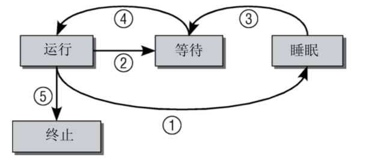
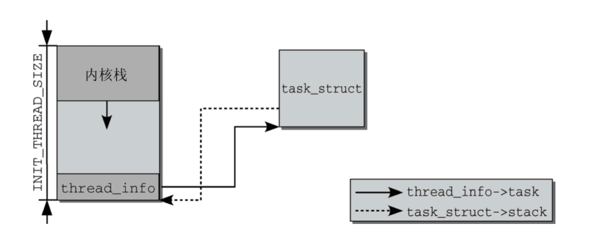
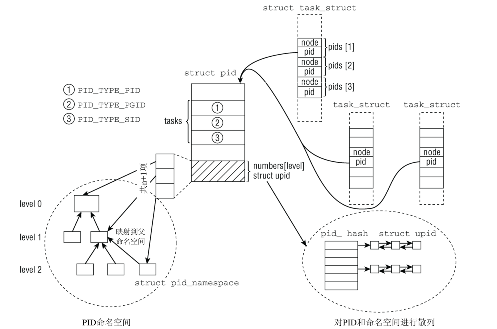
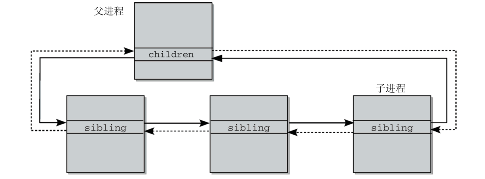
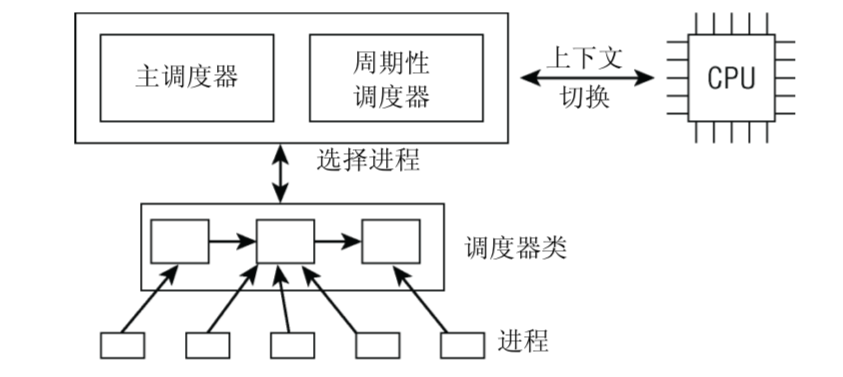
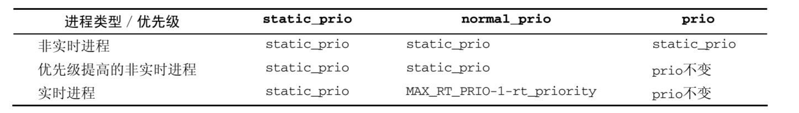
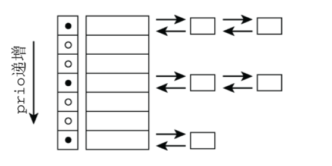

# 第二章·进程表示和进程调度
---

> 关键词: 进程的表示&进程调度

### 进程状态




### 进程数据结构

> Linux涉及进程都是围绕着`task_struct`结构建立

简化的task_struct代码 (2.6版)

```c
// <sched.h> 
struct task_struct { 
    /* -1表示不可运行，0表示可运行，>0表示停止 */
    volatile long state;
    void *stack; 
    atomic_t usage;
    /* 进程标志，下文定义 */ 
    unsigned long flags;
    unsigned long ptrace;
    /* 大内核锁深度 */ 
    int lock_depth;

    /* 动态优先级 */
    int prio;
    /* 普通优先级 */
    int normal_prio;
    /* 静态优先级, 进程启动时分配 */
    int static_prio; 
    /* 包含个进程进程的运行表 */
    struct list_head run_list;

    /* 进程所属调度器类 */
    const struct sched_class *sched_class; 
    /* 调度器类通过该属性调度进程 */
    struct sched_entity se;
    
    unsigned short ioprio;
    /* 进程调度策略 */
    unsigned long policy; 
    /* 针对多处理器系统, 限制进程在那些cpu上运行 */
    cpumask_t cpus_allowed; 
    /* 该进程在cpu上剩余运行时间 */
    unsigned int time_slice;
#if defined(CONFIG_SCHEDSTATS) || define (CONFIG_TASK_DELAY_ACCT) 
    struct sched_info sched_info;
#endif 
    /* ptrace_list/ptrace_children链表是
     * ptrace能够看到的当前进程的子进程列表。
     */
    struct list_head tasks;
    struct list_head ptrace_children; 
    struct list_head ptrace_list; 
    struct mm_struct *mm, *active_mm;
    
    /* 进程状态 */
    struct linux_binfmt *binfmt; 
    long exit_state;
    int exit_code, exit_signal; 
    
    /* 在父进程终止时发送的信号 */
    int pdeath_signal; 
    unsigned int personality; 
    unsigned did_exec:1; 

    /* 全局ID */  
    pid_t pid; 
    /* 线程组PID */
    pid_t tgid;

    /////////////////////////////////// 
    /* 真正的父进程（在被调试的情况下） */
    struct task_struct *real_parent;
    /* 父进程 */  
    struct task_struct *parent;
    /* 子进程链表 */
    struct list_head children;
    /* 连接到父进程的子进程链表 */ 
    struct list_head sibling;
    /* 线程组组长 */
    struct task_struct *group_leader; 
    //////////////////////////////////

    /* PID与PID散列表的联系。*/
    struct pid_link pids[PIDTYPE_MAX]; 
    struct list_head thread_group;
    
    /* 用于vfork() */
    struct completion *vfork_done; 
    /* CLONE_CHILD_SETTID */
    int __user *set_child_tid; 
    /* CLONE_CHILD_CLEARTID */
    int __user *clear_child_tid;

    /* 实时优先级 */
    unsigned long rt_priority;
    cputime_t utime, stime, utimescaled, stimescaled; 
    
    /* 上下文切换计数 */
    unsigned long nvcsw, nivcsw; 
    
    /* 单调时间 */
    struct timespec start_time;
    
    /* 启动以来的时间 */
    struct timespec real_start_time;  
    
    /* 内存管理器失效和页交换信息，这个有一点争论。
     * 它既可以看作是特定于内存管理器的， 
     * 也可以看作是特定于线程的 */ 
    unsigned long min_flt, maj_flt;

    cputime_t it_prof_expires, it_virt_expires; 
    unsigned long long it_sched_expires; 
    struct list_head cpu_timers[3];
    
    /* 进程身份凭据 */
    uid_t uid,euid,suid,fsuid; 
    gid_t gid,egid,sgid,fsgid; 
    struct group_info *group_info;
    kernel_cap_t cap_effective, cap_inheritable, cap_permitted;
    
    unsigned keep_capabilities:1; 
    struct user_struct *user;
    /* 除去路径后的可执行文件名称 
     * -用[gs]et_task_comm访问（其中用task_lock()锁定它） 
     * -通常由flush_old_exec初始化 */
    char comm[TASK_COMM_LEN]; 
    
    /* 文件系统信息 */ 
    int link_count, total_link_count;
    
    /* ipc相关 */
    struct sysv_sem sysvsem;
    
    /* 当前进程特定于CPU的状态信息 */ 
    struct thread_struct thread;
    
    /* 文件系统信息 */ 
    struct fs_struct *fs;
    
    /* 打开文件信息 */ 
    struct files_struct *files;
    
    /* 命名空间 */
    struct nsproxy *nsproxy;
    
    /* 信号处理程序 */
    struct signal_struct *signal; 
    struct sighand_struct *sighand;
    sigset_t blocked, real_blocked; 
    sigset_t saved_sigmask; /* 用TIF_RESTORE_SIGMASK恢复 */ 
    struct sigpending pending;
    unsigned long sas_ss_sp; 
    size_t sas_ss_size;
    int (*notifier)(void *priv); 
    void *notifier_data; 
    sigset_t *notifier_mask;
#ifdef CONFIG_SECURITY 
    void *security;
#endif 
    /* 线程组跟踪 */
    u32 parent_exec_id; 
    u32 self_exec_id;
    
    /* 日志文件系统信息 */ 
    void *journal_info; 
    
    /* 虚拟内存状态 */
    struct reclaim_state *reclaim_state; 
    struct backing_dev_info *backing_dev_info; 
    struct io_context *io_context;
    unsigned long ptrace_message;
    
    /* 由ptrace使用。*/ 
    siginfo_t *last_siginfo; 
    ... 
}; 
```

task_struct和thread_info以及内核栈的关系



线程ID

> 进程在该命名空间下的唯一标识

- 内核下pid结构

```c
struct pid
{
    refcount_t count;
    unsigned int level;
    spinlock_t lock;
    /* 使用此PID的任务列表 */
    struct hlist_head tasks[PIDTYPE_MAX];
    struct hlist_head inodes;
    /* wait queue for pidfd notifications */
    wait_queue_head_t wait_pidfd;
    struct rcu_head rcu;
    struct upid numbers[1];
};
```

- 命名空间下pid结构

```c
struct upid {
    /* 表示该命名空间下的ID值 */
    int nr;
    /* 指向命名空间 */
    struct pid_namespace *ns;
};
```



进程关系



### 进程相关系统调用

`fork`系列函数

- `fork :` 创建父进程的副本     
- `vfork :`(因为fork目前实现了写时复制, 而且比fork块, 故很少使用了) 
- `clone :` 产生线程

上述三个函数都需要依靠核心函数`do_fork`函数实现(内核2.6版本)

`do_fork`实现
```shell
do_fork
|----> 复制父进程
|    |----> 检查标志
|    |----> dup_task_struct建立父进程的task_struct副本
|    |----> 检查资源限制
|    |----> 初始化task_struct结构
|    |----> sched_fork
|    |----> 复制/共享进程各个部分
|    |    |----> copy_semundo
|    |    |----> copy_files
|    |    |----> copy_fs
|    |    |----> copy_sighand
|    |    |----> copy_signal
|    |    |----> copy_mm
|    |    |----> copy_namespace
|    |    |----> copy_thread
|    |----> 设置进程关系等等
|----> 在父进程命名空间选择pid
|----> 初始化vfork的完成处理程序(在设置CLONE_VFORK)和ptrace标志
|----> wake_up_new_task函数唤醒子进程
|----> 是否设置了CLONE_VFORK标志位
|    |----> wait_for_completion
```

`exec`系列函数 

`execve`系统调用入口为`sys_execve`函数, 核心函数为`do_execve`

```c
// kernel/exec.c (2.6版本)
int do_execve(char* filename, 
              char* __user *__user *argv,
              char* __user *__user *envp,
              struct pt_regs *regs)
```

`do_execve`函数流程

```shell
do_execve
|----> 打开可执行文件
|    |----> bprm_init
|    |    |----> mm_alloc
|    |    |----> init_new_context
|    |    |----> __bprm_mm_init
|    |----> prepare_binprm
|    |----> 复制环境和参数数组内容
|    |----> search_binary_handler
```

### 进程调度

调度子系统图示



- 主调度器
> 进程打算睡眠或者其他原因放弃CPU
- 周期性调度器
> (1) 管理内核中与整个系统和各个进程的调度相关的统计量。其间执行的主要操作是对各种计数器加1，
> (2) 激活负责当前进程的调度类的周期性调度方法。


上述两个组件又统称为通用调度器或者核心调度器


- 调度器类
> 调度器类用于判断接下来运行哪个进程。内核支持不同的调度策略（完全公平调度、实时调度、 在无事可做时调度空闲进程）
> 调度类使得能够以模块化方法实现这些策略，即一个类的代码不需要与其他类的代码交互, 在调度器被调用时，它会查询调度器类，得知接下来运行哪个进程。每个进程都对应一个调度器类

调度器类主要源码
```c
// <sched.h> 
struct sched_class { 
    /* 将所有调度器类组合成链表, 在编译期构建此链表 
     * 且链表构建从前往后顺序为 
     * 实时进程 > 完全公平进程 > 空闲进程 */
    const struct sched_class *next;

    /* 添加进程到就绪队列 */
    void (*enqueue_task) (struct rq *rq, struct task_struct *p, int wakeup); 
    /* 从就绪队列删除进程 */
    void (*dequeue_task) (struct rq *rq, struct task_struct *p, int sleep); 
    /* 进程自愿放弃cpu */
    void (*yield_task) (struct rq *rq);
    /* 唤醒新进程抢占当前进程, 比如fork */
    void (*check_preempt_curr) (struct rq *rq, struct task_struct *p);
    /* 选择下一个进程 */
    struct task_struct * (*pick_next_task) (struct rq *rq); 
    void (*put_prev_task) (struct rq *rq, struct task_struct *p); 
    /* 进程调度策略改变时调用 */
    void (*set_curr_task**) (struct rq *rq);
    /* 在周期性调度器激活时调用 */
    void (*task_tick) (struct rq *rq, struct task_struct *p); 
    /* fork时建立调度器和新进程的关系 */
    void (*task_new) (struct rq *rq, struct task_struct *p);
};
```

`struct rq`为就绪队列管理活动进程

就绪队列主要源码
```c
// kernel/sched.c 
struct rq {
    /* 可运行进程数目 */
    unsigned long nr_running; 
#define CPU_LOAD_IDX_MAX 5
    /* 跟踪此前负载 */
    unsigned long cpu_load[CPU_LOAD_IDX_MAX];
... 
    /* 就绪队列当前负载 */
    struct load_weight load;
    
    /* 子就绪队列用于完全公平调度器 */
    struct cfs_rq cfs; 
    /* 子就绪队列用于实时调度器 */
    struct rt_rq rt;

    /* curr指向当前进程, 
     * idle指向idle进程
     * (当系统中没有任何进程可以调度时进入idle进程) */
    struct task_struct *curr, *idle; 
    u64 clock;
...
};
```
调度实体
> 绑定相应进程,进行调度, 或者用于组调度

```c
// <sched.h> 
struct sched_entity {
    /* 各个实体占就绪队列总负荷的比例 */
    struct load_weight load;  
    /* 红黑树节点 */
    struct rb_node run_node; 
    /* 是否接受调度 */
    unsigned int on_rq;
    /* 加入就绪队列时间 */
    u64 exec_start; 
    /* 总的调度时间 */
    u64 sum_exec_runtime;
    /* 记录进程执行消耗的虚拟事件 */ 
    u64 vruntime; 
    u64 prev_sum_exec_runtime;
...
}
```

优先级内核表示


优先级计算




- 上下文切换

```c
// kernel/sched.c 
static inline void
context_switch(struct rq *rq, struct task_struct *prev, struct task_struct *next)
{ 
    struct mm_struct *mm, *oldmm;
    prepare_task_switch(rq, prev, next); 
    mm = next->mm;
    oldmm = prev->active_mm;
...
    if (unlikely(!mm)) {
        next->active_mm = oldmm; 
        atomic_inc(&oldmm->mm_count);
        /* 惰性TLB */ 
        enter_lazy_tlb(oldmm, next);
    } else
        /* 切换内存管理上下文 */
        switch_mm(oldmm, mm, next);
...
    /* 这里我们只是切换寄存器状态和栈。 */ 
    switch_to(prev, next, prev);
    barrier(); 
    finish_task_switch(this_rq(), prev);
}
```

### 一些具体调度器类

#### 公平调度器类(CFS)

```c
// kernel/sched_fair.c 
static const struct sched_class fair_sched_class = { 
    .next = &idle_sched_class, 
    .enqueue_task = enqueue_task_fair, 
    .dequeue_task = dequeue_task_fair, 
    .yield_task = yield_task_fair,
    .check_preempt_curr = check_preempt_wakeup,
    .pick_next_task = pick_next_task_fair,
    .put_prev_task = put_prev_task_fair,
... 
    .set_curr_task = set_curr_task_fair, 
    .task_tick = task_tick_fair, 
    .task_new = task_new_fair,
};
```
CFS的就绪队列

```c
// kernel/sched.c 
struct cfs_rq {
    struct load_weight load;        /* 进程负荷值 */ 
    unsigned long nr_running;       /* 队列上可运行的进程数 */
    u64 min_vruntime;               /* 所有进程最小运行时间 */
    struct rb_root tasks_timeline;  /* 红黑树节点管理所有进程 */
    struct rb_node *rb_leftmost;    /* 最左节点最需要管理的进程 */
    struct sched_entity *curr;      /* 指向当前进程的可调度实体 */
}
```

CFS的调度方法

```shell
1.计算虚拟时钟 # TODO 实现红黑树
2.延迟追踪
```

#### 实时调度器类

> 实时进程与普通进程有一个根本的不同之处：如果系统中有一个实时进程且可运行，那么调度器 总是会选中它运行，除非有另一个优先级更高的实时进程。

实时进程调度类代码

```c
// kernel/sched-rt.c 
const struct sched_class rt_sched_class = { 
    .next = &fair_sched_class, 
    .enqueue_task = enqueue_task_rt, 
    .dequeue_task = dequeue_task_rt, 
    .yield_task = yield_task_rt,
    .check_preempt_curr = check_preempt_curr_rt,
    .pick_next_task = pick_next_task_rt, 
    .put_prev_task = put_prev_task_rt,
    .set_curr_task = set_curr_task_rt, 
    .task_tick = task_tick_rt,
};
```

两种实时类

- 循环进程
- FIFO进程

实时进程就绪队列



### 调度器增强

- SMP调度
  - 数据结构扩展
  - 迁移线程
  - 核心调度器改变
- 调度域和控制组
- 内核抢占
- 低延迟

### 参考文章

https://www.cnblogs.com/LoyenWang/p/12249106.html