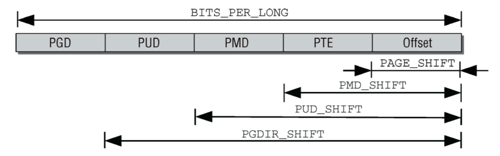

# 第三章·内存管理
---

### 一、概述

**管理物理内存的两种计算机模型**

- UMA计算机（一致内存访问，uniform memory access）将可用内存以连续方式组织起来（可 能有小的缺口）。SMP系统中的每个处理器访问各个内存区都是同样快。 
- NUMA计算机（非一致内存访问，non-uniform memory access）总是多处理器计算机。系统的各个CPU都有本地内存，可支持特别快速的访问。各个处理器之间通过总线连接起来，以支持对其他CPU的本地内存的访问，当然比访问本地内存慢些。

uma.png)

**NUMA内存组织结构**


### 二、相关数据结构

- 结点

```c
// mmzone.h
typedef struct pglist_data { 

    // 包含内存域中内存域数据结构
    struct zone node_zones[MAX_NR_ZONES]; 
    // 指定了备用结点及其内存域的列表，
    // 以便在当前结点没有可用空间时，在备用结点分配内存
    struct zonelist node_zonelists[MAX_ZONELISTS]; 
    // 保存结点中不同内存域的数目
    int nr_zones;
    // 指向page子数组
    struct page *node_mem_map; 
    // 用于内核初始化
    struct bootmem_data *bdata;

    // 第一个页帧编号
    unsigned long node_start_pfn; 
    // 物理内存页的总数
    unsigned long node_present_pages; 
    // 物理内存页的总长度 
    unsigned long node_spanned_pages;

    // 结点id 
    int node_id;
    // 下一个内存结点
    struct pglist_data *pgdat_next;
    
    // 见18章 
    wait_queue_head_t kswapd_wait; 
    struct task_struct *kswapd; 
    int kswapd_max_order;
} pg_data_t;
```
- 内存域
  
```c
// mmzone.h
// ZONE_PADDING 填充结构将数据放在一个缓冲行，便于快速访问
struct zone { 
    /////////////////////////////////////////
    /* 通常由页分配器访问的字段 */
    unsigned long pages_min, pages_low, pages_high;
    unsigned long lowmem_reserve[MAX_NR_ZONES];

    // 用于实现冷热页
    // struct per_cpu_pageset { 
    //  //索引0对应热页，索引1对应冷页
    //  struct per_cpu_pages pcp[2];
    // } ____cacheline_aligned_in_smp;
    struct per_cpu_pageset pageset[NR_CPUS];
    /*
    * 不同长度的空闲区域
    */
    spinlock_t lock;
    struct free_area free_area[MAX_ORDER];
    ZONE_PADDING(_pad1_)
    //////////////////////////////////////////

    //////////////////////////////////////////
    /* 通常由页面收回扫描程序访问的字段 */
    spinlock_t lru_lock;

    // 活动页和非活动页
    struct list_head active_list;
    struct list_head inactive_list;
    // 在回收内存时需要扫描的活动和不活动页的数目。
    unsigned long nr_scan_active;
    unsigned long nr_scan_inactive;

    // 上一次回收以来扫描过的页
    unsigned long pages_scanned;
    // 内存域标志 
    unsigned long flags; 
    // 内存域统计量
    atomic_long_t vm_stat[NR_VM_ZONE_STAT_ITEMS];
    // 内存域优先级
    int prev_priority;
    ZONE_PADDING(_pad2_)
    //////////////////////////////////////////

    /* 很少使用或大多数情况下只读的字段 */
    wait_queue_head_t * wait_table;
    unsigned long wait_table_hash_nr_entries;
    unsigned long wait_table_bits;
    /* 支持不连续内存模型的字段。 */
    struct pglist_data *zone_pgdat;
    unsigned long zone_start_pfn;
    unsigned long spanned_pages; /* 总长度，包含空洞 */
    unsigned long present_pages; /* 内存数量（除去空洞） */
    /*
    * 很少使用的字段：
    */
 char *name;
} ____cacheline_maxaligned_in_smp; 
```

- 页帧

```c
// mm.h
struct page {
    // 页标志位，具体见P122
    unsigned long flags; 
    // 引用计数
    atomic_t _count; 
    union {
        // 被页表指向数
        atomic_t _mapcount; 
        // 用于SLUB分配器：对象的数目
        unsigned int inuse; 
    };
    union {
        struct {
            // 指向私有数据
            unsigned long private; 
            // 指向页帧所在地址空间，详细见第四章
            struct address_space *mapping; 
        };
        /* ... */
        /* 用于SLUB分配器：指向slab的指针 */
        struct kmem_cache *slab; 
        /* 用于复合页的尾页，指向首页 */
        struct page *first_page; 
    };
    union {
        /* 在mapping内的偏移量 */
        pgoff_t index; 
        void *freelist; 
    };
    struct list_head lru; 
#if defined(WANT_PAGE_VIRTUAL)
/* 内核虚拟地址（如果没有映射则为NULL，即高端内存） */
    void *virtual; 
#endif /* WANT_PAGE_VIRTUAL */
};
```

### 三、页表

**四级页表结构**



### 四、初始化内存管理

- [ ] 待写

### 五、物理内存管理

#### 伙伴系统

**设计意图**

> 通过申请小内存的时候，不会从大块的连续空闲内存中截取，减少外碎片产生的可能性

**伙伴系统基本结构**


**原理图示**


**伙伴系统和内存域/节点的关系图示**


**对伙伴系统反碎片的优化**

**1. 依据可移动性组织页**

- 不可移动页

> 在内存中有固定位置，不能移动到其他地方。核心内核分配的大多数内存属于 该类别。

- 可回收页

> 不能直接移动，但可以删除，其内容可以从某些源重新生成

- 可移动页

> 可移动页可以随意地移动。属于用户空间应用程序的页属于该类别。它们是通过页表映射的。 如果它们复制到新位置，页表项可以相应地更新，应用程序不会注意到任何事

页的可移动性取决于它属于上述三类中的哪一类，内核将页面按照不同的可移动性进行分组，通过这种技术，虽然在不可移动页中仍可能出现碎片，但是由于具有不同可移动性的页不会进入同一个组，因而其它两个类型的内存块就可以获得较好的“对抗碎片”的特性

**2. 虚拟可移动内存域**

基本思想

> 可用的物理内存划分为两个内存域，一个用于可移动分配，一个用于不可移动分配。这会自动防止不可移动页向可移动内存域引入碎片。

-----
- [ ] slab分配器