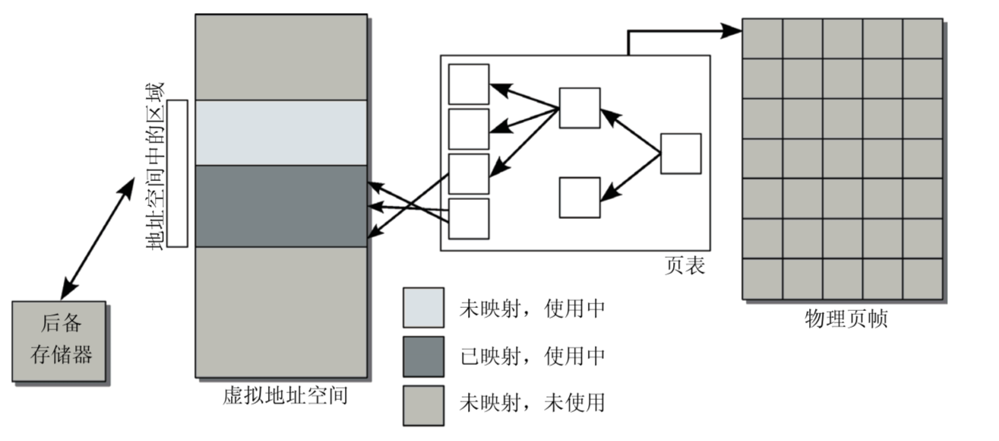
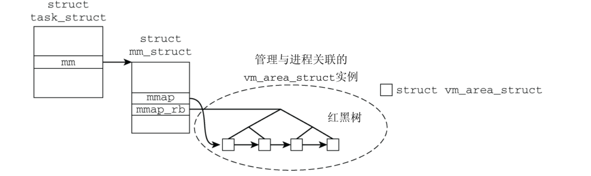
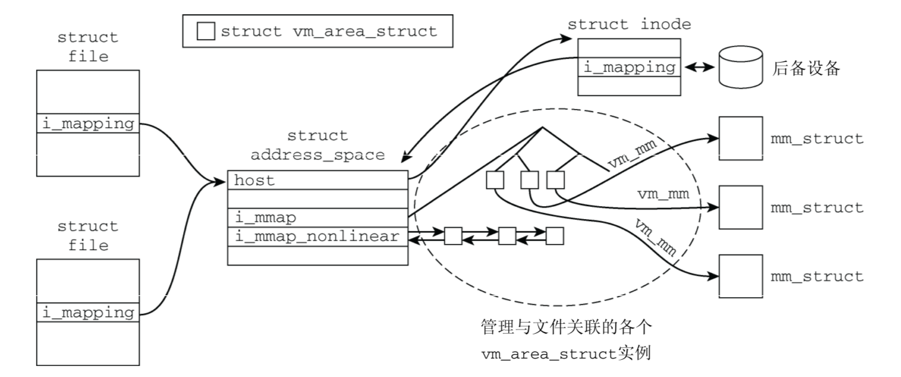
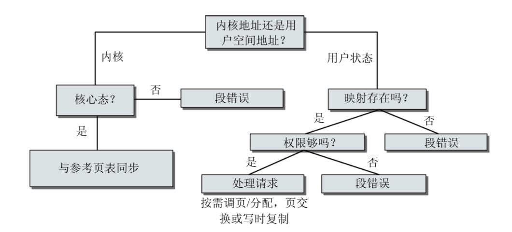

# 第四章·进程虚拟内存
---

```c
// TODO: 优先搜索树 MMAP原理图示
```

### 进程空间地址的布局

基本结构
- 当前运行的二进制代码(text段)
- 程序使用动态库的代码
- 存储全局变量和动态产生数据的堆
- 保存局部变量和实现函数/过程调用的栈
- 环境变量和命令行参数的段
- 将文件内容映射到虚拟地址空间的内存映射

`struct mm_struct`保存了内存管理信息

```c
// <mm_types.h> 
struct mm_struct { ...
    unsigned long (*get_unmapped_area) (struct file *filp,
                unsigned long addr, unsigned long len, 
                unsigned long pgoff, unsigned long flags);
...
    unsigned long mmap_base; /* mmap区域的基地址 */ 
    unsigned long task_size; /* 进程虚拟内存空间的长度 */
...
    
    unsigned long start_code, end_code; /* 标记可执行代码所占区域 */ 
    unsigned long start_data, end_data; /* 标记已初始化数据区域 */
    unsigned long start_brk;            /* 堆起始地址 */
    unsigned long brk;                  /* 堆当前结束地址 */
    unsigned long start_stack;          /* 栈起始地址 */
    unsigned long arg_start, arg_end;   /* 参数列表地址范围 */
    unsigned long env_start, env_end;   /* 环境变量地址范围 */
...
}
```

如何建立布局

```shell
加载ELF文件
|   -> 是否设置PF_RANDOMIZE
|   -> arch_pick_mmap_layout
|   -> setup_arg_pages
```

### 内存映射原理



- 进程试图访问用户地址空间中的一个内存地址，但使用页表无法确定物理地址（物理内存中 没有关联页）
- 处理器接下来触发一个缺页异常，发送到内核。 
- 内核会检查负责缺页区域的进程地址空间数据结构，找到适当的后备存储器，或者确认该访 问实际上是不正确的。
- 分配物理内存页，并从后备存储器读取所需数据填充。 
- 借助于页表将物理内存页并入到用户进程的地址空间，应用程序恢复执行。 

### 相关数据结构

```c
// <mm_types.h> 
struct mm_struct {
    struct vm_area_struct * mmap;       /* 虚拟内存列表 */ 
    struct rb_root mm_rb;               /* 红黑树根节点 */
    struct vm_area_struct * mmap_cache; /* 缓存上一次find_vma的结果 */
...
}
```





虚拟内存区域的表示

> 每个区域表示为`vm_area_struct`的一个实例

`vm_area_struct`部分代码

```c
// <mm_types.h> 
struct vm_area_struct {
    struct mm_struct * vm_mm;   /* 所属地址空间。*/ 
    
    /* 该区域在用户地址空间的范围 */
    unsigned long vm_start;     
    unsigned long vm_end;       
    
    /* 各进程的虚拟内存区域链表，按地址排序 */ 
    struct vm_area_struct *vm_next;
    pgprot_t vm_page_prot;      /* 该虚拟内存区域的访问权限。 */ 
    unsigned long vm_flags;     /* 标志，如下列出。 */
    
    /* 红黑树节点用于查询虚拟内存 */
    struct rb_node vm_rb;       
    

    union {
        struct {
            struct list_head list; 
            void *parent; 
            struct vm_area_struct *head;
            } vm_set; 

        /* 优先树节点 */
        struct raw_prio_tree_node prio_tree_node; 
    } shared;
    
    /* 匿名映射 */
    struct list_head anon_vma_node; 
    struct anon_vma *anon_vma;     

    struct vm_operations_struct * vm_ops;   /* 映射区相关操作 */
    unsigned long vm_pgoff;                 /* 文件映射的偏移量 */
    struct file * vm_file;                  /* 映射到的文件 */
    void * vm_private_data;                 /* vm_pte */
...
```

使用优先查找树, 文件给定区间所映射到的虚拟地址空间



### 对区域的操作

- 虚拟地址关联到区域
- 区域合并
- 插入区域
- 创建区域

### 地址空间

### MMAP

### 系统缺页异常



### 参考

https://cloud.tencent.com/developer/article/1145377