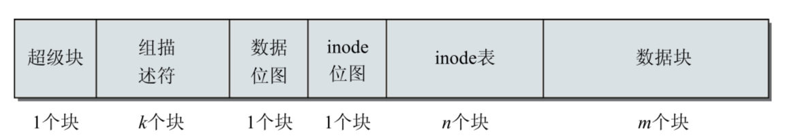

# 第九章·Ext文件系统族
---

```c
// TODO: 预分配深究 文件系统相关操作
```

### EXT2文件系统

**块组**

> 每个ext2文件系统都由大量块组组成

块组结构图示



块组各个部分
- 超级块
  - 存储文件系统核心数据（空闲和已使用块数目，块长度，当前文件状态，时间戳，表示文件系统的魔数等等）
- 组描述符
  - 描述块组的空闲块和inode数目
- 数据位图
  - bitmap表示对应位数据块是否使用
- inode位图
  - bitmap笔试对应inode是否使用
- inode表
  - 包含块组所有inode，inode用于保存文件系统中与各个文件和目录相关的所有元数据
- 数据块
  - 存文件数据

**块组及其他相关数据结构**

1. 超级块
```c
// <ext2_fs.h> 
struct ext2_super_block { 
    __le32 s_inodes_count;      /* inode数目 */ 
    __le32 s_blocks_count;      /* 块数目 */
    __le32 s_r_blocks_count;    /* 已分配块的数目 */ 
    __le32 s_free_blocks_count; /* 空闲块数目 */ 
    __le32 s_free_inodes_count; /* 空闲inode数目 */ 
    __le32 s_first_data_block;  /* 第一个数据块 */ 
    __le32 s_log_block_size;    /* 块长度 */ 
    __le32 s_log_frag_size;     /* 碎片长度*/
    __le32 s_blocks_per_group;  /* 每个块组包含的块数 */
    __le32 s_frags_per_group;   /* 每个块组包含的碎片*/ 
    __le32 s_inodes_per_group;  /* 每个块组的inode数目 */ 
    __le32 s_mtime;             /* 装载时间 */
    __le32 s_wtime;             /* 写入时间 */
    __le16 s_mnt_count;         /* 装载计数 */
    __le16 s_max_mnt_count;     /* 最大装载计数 */ 
    __le16 s_magic;             /* 魔数，标记文件系统类型 */
    __le16 s_errors;            /* 检测到错误时的行为 */
    __le32 s_rev_level;         /* 修订号 */
    __le16 s_minor_rev_level;   /* 副修订号 */

    /* 用于检查文件一致性 */
    __le16 s_state;             /* 文件系统状态 */ 
    __le32 s_lastcheck;         /* 上一次检查的时间 */
    __le32 s_checkinterval;     /* 两次检查允许间隔的最长时间 */
    __le32 s_creator_os;        /* 创建文件系统的操作系统 */
    
    /* 用于根储备 */
    __le16 s_def_resuid;        /* 能够使用保留块的默认UID */ 
    __le16 s_def_resgid;        /* 能够使用保留块的默认GID */
    
    /* 
     * 以下字段只用于EXT2_DYNAMIC_REV超级块。
     */
    __le32 s_first_ino;         /* 第一个非保留的inode */
    __le16 s_inode_size;        /* inode结构的长度 */
    __le16 s_block_group_nr;    /* 当前超级块所在的块组编号 */  
    __le32 s_feature_compat;    /* 兼容特性集 */
    __le32 s_feature_incompat;  /* 不兼容特性集 */
    __le32 s_feature_ro_compat; /* 只读兼容特性集 */
    __u8 s_uuid[16];            /* 卷的128位uuid */
    char s_volume_name[16];     /* 卷名 */
    char s_last_mounted[64];    /* 上一次装载的目录 */
    __le32 s_algorithm_usage_bitmap; /* 用于压缩 */ 
    /* 
    * 性能提示。
    * 仅当设置了EXT2_COMPAT_PREALLOC标志时，才能进行目录的预分配。 
    */
    __u8 s_prealloc_blocks;     /* 试图预分配的块数*/
    __u8 s_prealloc_dir_blocks; /* 试图为目录预分配的块数 */
    __u16 s_padding1; 
    /* 
    * 如果设置了EXT3_FEATURE_COMPAT_HAS_JOURNAL，
    * 日志支持才是有效的。 
    */
...
    __u32 s_reserved[190];
};
```
2. 组描述符

```c
// <ext2_fs.h> 
struct ext2_group_desc {
    __le32 bg_block_bitmap;         /* 块位图块 */ 
    __le32 bg_inode_bitmap;         /* inode位图块 */
    __le32 bg_inode_table;          /* inode表块 */
    __le16 bg_free_blocks_count;    /* 空闲块数目 */ 
    __le16 bg_free_inodes_count;    /* 空闲inode数目 */ 
    __le16 bg_used_dirs_count;      /* 目录数目 */ 
    __le16 bg_pad; 
    __le32 bg_reserved[3];
};
```

3. inode表

```c
// <ext2_fs.h> 
struct ext2_inode { 
    __le16 i_mode;          /* 文件模式 */ 
    __le16 i_uid;           /* 所有者UID的低16位 */ 
    __le32 i_size;          /* 长度，按字节计算 */ 

    /* 时间戳 */
    __le32 i_atime;         /* 访问时间 */ 
    __le32 i_ctime;         /* 创建时间 */ 
    __le32 i_mtime;         /* 修改时间 */
    __le32 i_dtime;         /* 删除时间 */
    __le16 i_gid;           /* 组ID的低16位 */  
    __le16 i_links_count;   /* 链接计数 */ 
    __le32 i_blocks;        /* 块数目 */
    __le32 i_flags;         /* 文件标志 */
    union {
        struct { 
            __le32 l_i_reserved1;
        } linux1; 
        struct {
        ... 
        } hurd1; 
        struct { 
        ... 
        } masix1;
    } osd1;                 /* 特定于操作系统的第一个联合 */
    __le32 i_block[EXT2_N_BLOCKS];  /* 块指针（块号） */
    __le32 i_generation;            /* 文件版本，用于NFS */
    __le32 i_file_acl;              /* 文件ACL */
    __le32 i_dir_acl;               /* 目录ACL */
    __le32 i_faddr;                 /* 碎片地址*/
    union {
        struct { 
            __u8 l_i_frag;  /* 碎片编号 */ 
            __u8 l_i_fsize; /* 碎片长度 */
            __u16 i_pad1;
            __le16 l_i_uid_high;    /*  */
            __le16 l_i_gid_high;
            __u32 l_i_reserved2;
        } linux2; 
        struct { 
            ... 
        } hurd2; 
        struct {
            ... 
        } masix2;
    } osd2;               /* 特定于操作系统的第二个联合 */
}
```

4.目录项

```c
//<ext2_fs.h> 
struct ext2_dir_entry_2 { 
    __le32 inode;               /* inode编号 */
    __le16 rec_len;             /* 目录项长度 */
    __u8 name_len;              /* 名称长度 */
    __u8 file_type              /* 文件类型 */
    char name[EXT2_NAME_LEN];   /* 文件名 */
};
```

**文件系统操作**

- 用于操作文件内容的操作保存在file_operations中。 
- 用于此类文件对象自身的操作保存在inode_operations中。
- 用于一般地址空间的操作保存在address_space_operations中。


### EXT3 文件系统

Ext3的基本思想在于，将对文件系统元数据的每个操作都视为事务，在执行之前要先行记录到日 志中。在事务结束后（即，对元数据的预期修改已经完成），相关的信息从日志删除。如果事务数据 已经写入到日志之后，而实际操作执行之前（或期间），发生了系统错误，那么在下一次装载文件系 统时，将会完全执行待决的操作。接下来，文件系统自动恢复到一致状态。如果在事务数据尚未写到 日志之前发生错误，那么在系统重启时，由于关于该操作的数据已经丢失，因而不会执行该操作，但至少保证了文件系统的一致性。